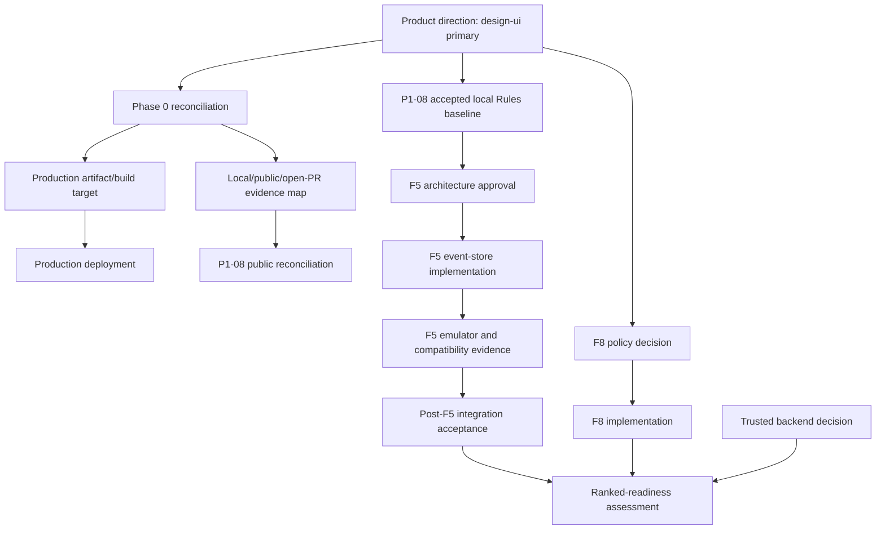

# MASTER ARCHITECTURE & EXECUTION PLAN — ESTIMATION

> **Status:** `[FACT]` This document is the current consolidated architecture index and execution plan for the active repository. It preserves the distinction between implementation reality, historical intent, explicit proposals, recommendations, open decisions, and known limitations.
>
> **Scope of this persistence task:** documentation only. No gameplay, Rules, application, test, build, CI, deployment, branch, or migration change is authorized by this document's creation.

## 1. Executive Architecture Summary

The active repository is a **JavaScript/browser-first multiplayer product**. `design-ui/` is the current production-direction implementation and contains the active match UI, service layer, adapter layer, Firebase persistence integration, gameplay engines, and multiplayer synchronization work. `src/` is legacy/transitional score-tracker code and is not the target architecture for the full multiplayer product. `[FACT]`

The repository is not a single uniformly published state. Three evidence planes must remain distinct:

| Plane | Meaning | Current interpretation |
| --- | --- | --- |
| **LOCAL ACTIVE REPOSITORY** | The local checkout, worktree, local commits, and local uncommitted files | Contains the active `design-ui/` work and locally verified commits not necessarily published |
| **PUBLIC GITHUB** | Pushed branches and the public `origin/*` state | Does not automatically contain local commits that are ahead of `origin/main` |
| **OPEN PR STATE** | Unmerged pull-request branches and proposed changes | Must be treated as proposed work until merged and verified in the active checkout |

P1-08-R/P1-08-R-FIX is locally accepted and verified in commit `c1bdde16a3c545b7dd56ed83e31e520dcf0a80e0`, with accepted Rules SHA-256 `a7cfba9833c324581047e16d498bae7e8a9ed4b54250723cd5a30f45209f001f`. `[FACT]` This commit is **LOCAL VERIFIED / NOT PUBLICLY RECONCILED**; it must not be described as publicly published.

P1-09/F5 has an explicit proposed direction—`matches/{matchId}/plays/{autoId}` with append/create-only semantics—but the complete behavior-changing event-store contract remains `[OPEN]`. The Master Plan must not authorize an implementation agent to invent the event schema, event identity, sequence model, replay/projection model, migration policy, dual-read/dual-write policy, cutover, live-match handling, or rollback behavior.

The next execution phase is **Phase 0 — Reconciliation & Foundation**. Phase 0 is a roadmap item only in this document; it is not executed by this persistence task.

## 2. Project Reconstruction

The repository evolved through a sequence of browser-first multiplayer sprints. Historical commits show the current product being assembled around vanilla JavaScript services and engines, Firestore persistence, and real-time client synchronization. The active artifact is therefore not equivalent to the historical Android/Kotlin/Compose/MVI product intent described in older planning material.

| Reconstruction finding | Status | Interpretation |
| --- | --- | --- |
| Vanilla JavaScript/browser multiplayer implementation | `[FACT]` | Active source exists under `design-ui/`, including match UI, services, adapters, and engines |
| `design-ui/` as current product direction | `[FACT]` | Recorded by the accepted product-direction decision and reflected in active work |
| `src/` as full multiplayer target | `[LIMITATION]` / rejected direction | `src/` remains legacy/transitional score-tracker code |
| Android/Kotlin/Compose/MVI implementation | `[HISTORICAL]` | Historical/unrealized platform intent; not current implementation reality |
| Firebase/Firestore client-authoritative Spark MVP | `[FACT]` | Current services write through Firestore Rules; several known trust limitations are documented |
| Trusted backend gameplay authority | `[RECOMMENDED]` | Future hardening direction, not currently deployed |

The repository's architecture must be reconstructed from active source and current documentation first. Historical Sprint folders, review archives, branches, and reports are useful evidence but cannot silently override current implementation reality.

## 3. Repository State Reconciliation

The current local checkout is the primary implementation evidence. At the start of this documentation persistence task, the observed identity was:

| Item | Observed state |
| --- | --- |
| Branch | `main` |
| HEAD | `c1bdde16a3c545b7dd56ed83e31e520dcf0a80e0` |
| Relationship | `main...origin/main [ahead 2]` |
| Staged files | None |
| Working-tree `firestore.rules` SHA-256 | `a7cfba9833c324581047e16d498bae7e8a9ed4b54250723cd5a30f45209f001f` |
| `HEAD:firestore.rules` SHA-256 | `a7cfba9833c324581047e16d498bae7e8a9ed4b54250723cd5a30f45209f001f` |
| Pre-existing dirty state | Extensive inherited source, documentation, tests, verification, configuration, and untracked regression work |

The local commit `c1bdde16a3c545b7dd56ed83e31e520dcf0a80e0` is not to be conflated with public GitHub state. `[FACT]` It is locally present and verified; `[OPEN]` public reconciliation, pushing, or merging is a separate Phase 0 decision and is prohibited in this task.

The repository also contains proposed/open-PR evidence. PR #3 is not to be described as merged. `[FACT from supplied architecture-review evidence]` It remains open/unmerged and its changes are proposed work. PR #4 is not accepted production architecture. Its documentation may inform analysis, but committed `node_modules/` and `dist/` contamination must remain classified as a repository-hygiene problem rather than accepted implementation.

## 4. Current Architecture

The active product architecture is layered:

```text
Browser UI
  ├── design-ui/lobby/index.html
  └── design-ui/match/index.html
        ↓
MatchService / RoomService / PlayerService / SessionService
        ↓
MatchAdapter and synchronization listeners
        ↓
GameSession and pure gameplay engines
  ├── BiddingEngine
  ├── TableEngine
  ├── ScoringEngine
  ├── Dealer / Deck / Cards
        ↓
Firebase Auth + Firestore + Firestore Rules
```

`MatchService` owns persistence operations and lifecycle transitions. `MatchAdapter` translates persisted match state into local engine state and handles synchronization, replay, reconnect, and local-seat mapping. The engines determine gameplay legality, bidding transitions, trick resolution, dealing, and scoring in the active product. The UI should call service/adapter APIs rather than writing Firestore directly.

The architecture is intentionally client-authoritative in the Spark MVP. Firestore Rules provide structural, ownership, version, terminal, and append-shape protection, while full gameplay legality and some result correctness remain client-side. This is a deliberate product trade-off, not proof of ranked-grade trust.

## 5. Architecture / Implementation Identity Conflict

The principal identity conflict is between **historical/platform architecture intent** and **current executable implementation**.

| Topic | Historical or proposed identity | Current implementation identity | Plan treatment |
| --- | --- | --- | --- |
| Platform | Android/Kotlin/Compose/MVI intent | Vanilla JavaScript/browser-first | Historical intent remains unresolved product/platform decision |
| Product root | Legacy `src/` score tracker | `design-ui/` multiplayer product | `design-ui/` is the current target |
| Persistence authority | Future trusted/server or event-store concepts | Client services writing Firestore through Rules | Preserve current model until an explicit migration is approved |
| Deployment artifact | Mixed root/build history | `design-ui/` is intended production artifact but integration remains incomplete | Phase 0 must reconcile build/deployment truth |
| Public repository | Assumed single state | Local, public, and open-PR states diverge | Never collapse the evidence planes |

No future task may silently treat historical Kotlin/Compose documents, archived Sprint folders, open PRs, or speculative architecture as current source-of-truth implementation. Conversely, current JavaScript behavior must not be declared the final product architecture where the project has explicitly left an unresolved product/platform decision.

## 6. Source-of-Truth Model

The project uses multiple source-of-truth layers, each with a bounded responsibility:

| Domain | Current authority | Not authoritative |
| --- | --- | --- |
| Product direction | Accepted product-direction decision and active `design-ui/` implementation | Legacy `src/` as multiplayer architecture |
| Game rules | Updated authoritative gameplay rules document | Comments or inferred behavior that conflicts with it |
| Gameplay legality/scoring | Active pure engines in `design-ui/engine/` | Duplicated speculative formulas in UI or Rules |
| Match persistence | `MatchService` plus Firestore schema and Rules | Test-only mocks as production proof |
| Client synchronization | `MatchAdapter` and current Firestore listeners | Historical adapter snapshots not used by active build |
| Security constraints | Literal `firestore.rules` executed by real Firebase Rules Emulator | Plain-JS Rules simulations as CEL proof |
| Public release state | Pushed Git refs and merged PRs | Local commits or open PRs not reconciled publicly |
| Architecture decisions | Explicit, dated repository documents/ADRs | Newly recommended designs presented as facts |

For event-store work, the parent `matches/{matchId}.cardLog` is the current production authority. The proposed `matches/{matchId}/plays/{autoId}` path is an explicit future direction, not yet an approved complete source-of-truth model.

## 7. Gameplay Architecture / Forensics

The active gameplay flow is browser-first and engine-driven. Bidding, card legality, trick resolution, dealing, round advancement, completion, and scoring are represented in `design-ui/` services/adapters/engines. The architecture requires callers to validate through the real engine APIs rather than reproducing engine rules in Firestore Rules or UI-only code.

The active card flow is:

1. A local UI action requests `MatchService.submitCard()`.
2. The service resolves the authenticated user to a seat through the adapter.
3. The local `TableEngine` validates the proposed card and previews the next turn/phase.
4. A Firestore transaction writes the card-log append and related coordination fields.
5. The match listener delivers the changed parent document.
6. `MatchAdapter.applyRemoteCard()` replays the new entry through the local engine.
7. At trick boundaries, the engine deterministically resolves the trick locally.

Historical hardening commits explicitly preserve this architecture. Commit `26db510` closes a `cardLog` prefix-rewrite gap without changing the schema; commit `9d2aef1` hardens atomic card turn progression; commit `67bdc9c` fixes the null trick-boundary turn deadlock while preserving deterministic local resolution. These historical changes are implementation evidence, not an event-store authorization.

The updated gameplay rules establish four-player counter-clockwise dealer rotation, tied-highest winner semantics, legal negative/unbounded cumulative scores, and only the defined extension reasons `SAAYDA` and `SUPER_CALL`. P1-08 preserves those semantics without inventing score bounds.

## 8. Multiplayer Authority Audit

The multiplayer system is a layered authority model, not a single server-authoritative engine:

| Concern | Current enforcement | Confidence/limitation |
| --- | --- | --- |
| Authentication and membership | Firebase Auth plus match/room membership Rules | Strong structural enforcement |
| Seat ownership | Immutable match `seats` map and Rules checks | Strong for declared seat ownership |
| Version ordering | Firestore transactions plus exact Rules version increments | Strong for parent-document writes |
| Bidding/card ownership | Authenticated UID mapped to seat and current-turn checks | Strong structurally; full value legality remains engine/client-side |
| Card history integrity | Parent `cardLog` append shape plus P1-08 hardening | Still a documented client-authoritative boundary for competitive trust |
| Trick winner | Deterministic local `TableEngine` replay | Convergent when inputs converge; not independently server-recomputed |
| Hand secrecy/fairness | Per-seat hand reads and paired deal writes | Content fairness remains a documented MVP limitation |
| Presence/abandonment | Not implemented under current policy | F8 deferred |
| Ranked readiness | Not established | Must not be claimed |

The audit rule for future work is to identify which layer owns each fact. A client-side check may improve UX and prevent honest mistakes, but it is not equivalent to a Rules or trusted-backend invariant. A Rules check may enforce structural consistency, but it must not be described as replaying the gameplay engine.

## 9. Firestore Security Architecture

The active Rules architecture uses explicit field allowlists, ownership checks, immutable seat maps, version increments, room/match cross-document checks, hand-deal pairing, and terminal-state guards. P1-08-R/P1-08-R-FIX is accepted locally and must be preserved exactly unless a later task has a documented dependency and explicit scope.

P1-08 protections include:

| Protection | Current status |
| --- | --- |
| Exact four-seat dealer successor and supported contiguous under-four shapes | Locally verified and accepted |
| Exact final-score/winner tied-highest consistency without invented bounds | Locally verified and accepted |
| Flat integer `extendedRounds` monotonic/idempotent behavior | Locally verified and accepted |
| Terminal immutability across overlapping bid/card/action/round/extension/opening-turn/hand paths | Locally verified and accepted |
| Literal real-emulator proof | Required for future Rules work; prior P1-08 evidence used the literal file |

Rules language constraints are material. Unsupported JavaScript/CEL-style collection functions must not be introduced. The accepted Rules file uses compiler-proven constructs and fixed-seat explicit comparisons where needed. Static JS simulations may support intent checks but cannot substitute for literal Rules Emulator evidence.

The future F5 event path, if approved, must add a narrow event create rule and paired parent-cursor rule without weakening any P1-08 branch. Event update and delete must be denied, cross-match/cross-round/cross-hand writes must fail, and terminal-state guards must apply on every overlapping parent or event write path.

## 10. P1-08 Review

P1-08-R/P1-08-R-FIX is **LOCAL VERIFIED / NOT PUBLICLY RECONCILED**. It is committed locally in `c1bdde16a3c545b7dd56ed83e31e520dcf0a80e0` and has accepted Rules SHA-256 `a7cfba9833c324581047e16d498bae7e8a9ed4b54250723cd5a30f45209f001f`.

P1-08 was intentionally limited to Rules and focused emulator/test hardening. It did not authorize redesign of the gameplay engines, `src/`, presence, abandonment, ranked trust, or the F5 event-store migration. The accepted work includes no claim that the local commit is publicly published. Public reconciliation is a separate Phase 0 action and requires explicit authorization.

P1-08's accepted boundaries remain:

- F4 extension behavior uses the actual flat integer `extendedRounds` schema; extension reasons remain API/engine-only and are not invented as persisted fields.
- F5 plays event-store migration is not implemented by P1-08 and is addressed only as a later architecture/implementation track.
- F8 presence/abandonment remains deferred because its policy is undefined.
- The product remains unsuitable for ranked readiness where documented client-authoritative gaps remain.

## 11. P1-09 / F5 Review

The repository explicitly proposes `matches/{matchId}/plays/{autoId}` as an append/create-only subcollection direction. `[FACT]` The proposal is present in `docs/architecture/SecurityArchitecture.md` and independently reflected in Master Plan risk R6. `[OPEN]` The complete contract is not yet repository-authoritative.

The following are recommendations/open decisions, not established facts:

| F5 contract | Status |
| --- | --- |
| Event path | Explicitly proposed: `matches/{matchId}/plays/{autoId}` |
| Event schema | `[OPEN]` |
| Event identity | `[OPEN]` |
| Idempotency | `[OPEN]` |
| Sequence and ordering | `[OPEN]` |
| Replay/projection | `[OPEN]` |
| Migration and backfill | `[OPEN]` |
| Dual-read/dual-write | `[OPEN]` |
| Cutover and client compatibility | `[OPEN]` |
| Live-match treatment | `[OPEN]` |
| Rollback | `[OPEN]` |

No implementation agent may turn a previously recommended deterministic ID, `seq`, `playsCount`, parity, cursor, migration, or projection design into approved architecture without explicit approval. The next F5 implementation assignment must begin only after these decisions are authorized and must preserve P1-08 terminal, dealer, score, winner, and extension semantics.

## 12. Architectural Debt Register

| ID | Debt/risk | Current status | Impact | Next action |
| --- | --- | --- | --- | --- |
| D1 | Local/public/open-PR state divergence | `[OPEN]` | Release and audit ambiguity | Phase 0 reconcile refs and publication status |
| D2 | Build/deployment artifact may not ship `design-ui/` | `[OPEN]` | Correct code may not be deployed | Establish production build target and hosting pipeline |
| D3 | `cardLog` client-authoritative integrity risk | `[FACT]` documented | Not ranked-ready | Approve and implement F5 or trusted backend path |
| D4 | F5 event-store contract incomplete | `[OPEN]` | Blocks event-store implementation | Architecture approval gate |
| D5 | Hand content fairness is client-authoritative | `[LIMITATION]` accepted MVP risk | Competitive trust limitation | Trusted dealing backend when product justifies it |
| D6 | Full card/bid legality is not independently Rules-recomputed | `[LIMITATION]` | Soft-launch only | Trusted backend or accepted product boundary |
| D7 | Presence/abandonment policy undefined | `[OPEN]` | Lifecycle completeness gap | Define F8 product/policy scope |
| D8 | Legacy `src/` and active `design-ui/` coexist | `[FACT]` | Contributor confusion and build risk | Deprecation/migration plan without multiplayer rewrite |
| D9 | Historical archives and generated contamination | `[LIMITATION]` | Review/build hygiene risk | Classify and exclude from production artifacts |
| D10 | Rules verification depends on emulator availability | `[FACT]` | False confidence if simulated only | Require literal Emulator evidence for Rules claims |

## 13. Master Roadmap

The roadmap is ordered by dependency and evidence integrity, not by convenience.

| Phase | Objective | Status | Exit condition |
| --- | --- | --- | --- |
| **Phase 0 — Reconciliation & Foundation** | Reconcile local/public/open-PR states; establish `design-ui/` as shipped target; classify contamination; settle deployment/CI truth | `[OPEN]` next phase | Approved reconciliation record and clean release-source decision |
| **P1-08-R / FIX** | Harden dealer rotation, score/winner consistency, extension behavior, and terminal immutability | `[FACT]` locally accepted | Commit and Rules SHA verified; public status separately reconciled |
| **P1-09 / F5 Architecture** | Approve the event-store contract without inventing missing behavior | `[OPEN]` | Architecture owner approves source-of-truth, identity, ordering, migration, compatibility, and rollback |
| **P1-09 / F5 Implementation** | Implement event persistence/replay/Rules only after approval | Blocked pending approval | Real-emulator positives/negatives and legacy compatibility pass |
| **F8** | Define presence/abandonment policy and implementation | Deferred | Product policy and lifecycle authority approved |
| **Ranked-readiness hardening** | Trusted legality/dealing/scoring authority and dispute-safe history | Not ready | Threat model, backend authority, and end-to-end evidence approved |
| **Production integration** | Build/deploy the selected `design-ui/` artifact | `[OPEN]` | CI/build/hosting produce and serve the intended artifact |
| **Legacy deprecation** | Retire or isolate `src/` score-tracker path | Future | Deprecation decision, migration notes, and no accidental build dependency |

Phase 0 must not push local commits, merge PR #3, merge PR #4, cherry-pick branches, reconcile Rules histories by mutation, change deployment, change CI, or fix gameplay in this documentation task.

## 14. Dependency Graph



The critical dependency order is:

```text
Product direction
  → Phase 0 reconciliation
    → production artifact/build truth
    → public/local/PR state reconciliation
      → P1-08 publication decision
        → F5 contract approval
          → F5 implementation
            → literal emulator + compatibility evidence
              → production integration
                → ranked-readiness assessment
```

F5 implementation cannot be a prerequisite to architecture approval. F8 cannot be implemented merely because F5 is complete; its policy is independently undefined. Ranked readiness cannot be claimed from P1-08/F5 alone because client-authoritative legality, dealing, scoring, and operational trust boundaries remain.

## 15. Test Strategy

Testing must match the authority being claimed.

| Test layer | Purpose | Evidence standard |
| --- | --- | --- |
| Pure engine tests | Verify deterministic gameplay rules and transitions | Use the real active engines; do not duplicate formulas in tests as the only proof |
| Service/adapter tests | Verify caller orchestration, local validation, persistence shaping, replay, and retry behavior | Use focused fixtures and explicit state transitions; distinguish mocks from production proof |
| Literal Rules Emulator tests | Verify actual `firestore.rules` compilation/evaluation | Load `/home/ubuntu/demo-test/firestore.rules` directly; require positive and negative assertions; emulator unavailable is BLOCKED |
| Browser/E2E tests | Verify real UI wiring, multi-client convergence, terminal/rematch behavior | Use real UI/gameplay path; no direct Firestore shortcut for claimed gameplay evidence |
| Build/artifact tests | Verify selected production artifact | Confirm `design-ui/` is actually included in the production build and no contaminated archive is shipped |
| Security regression tests | Verify terminal, ownership, version, cross-path, and malformed-write boundaries | Include negative cases and inspect actual permission failures; never swallow failures |

For F5, the minimum real-emulator matrix after approval includes event creation, duplicate identity, same-ID/different-payload conflict, cross-match/hand/round/trick/seat rejection, update/delete rejection, sequence/order behavior, parent cursor pairing, terminal immutability, old `cardLog` bypass denial for v2, and legacy-match compatibility. Tests must use the literal production Rules file and report its SHA.

The test strategy must report three distinct categories: passed evidence, blocked evidence, and not-run evidence. A static JavaScript Rules simulation is not CEL proof and must be labeled accordingly.

## 16. Agent Execution Protocol

Every future execution agent must follow this protocol:

1. Read the task specification and all authoritative game-rule documents in full.
2. Record branch, HEAD, staged state, worktree status, relevant file hashes, and protected paths before mutation.
3. Identify whether the task is documentation, implementation, validation, reconciliation, or packaging.
4. Separate local active, public GitHub, and open-PR evidence.
5. Treat `[FACT]`, `[INFERRED]`, `[RECOMMENDED]`, `[OPEN]`, and `[LIMITATION]` labels as mandatory for material architecture claims.
6. Preserve unrelated dirty work. Never reset, clean, stash, discard, or overwrite it unless a task explicitly authorizes that exact operation.
7. Do not modify `src/**`, protected engines, Rules, tests, build, or deployment outside explicit task scope.
8. For Rules work, test the literal repository `firestore.rules` in the real Firebase Rules Emulator with both positive and negative assertions.
9. Do not treat a passing mock or static simulation as real-emulator proof.
10. Do not invent missing architecture. Stop and request/record an architecture decision when the contract is incomplete.
11. Run narrow tests first, then affected regressions, then build/lint/diff checks as required.
12. Capture exact commands, counts, exit codes, hashes, and failure causes.
13. Review changed paths against the pre-task baseline before any commit.
14. Do not commit or push unless the task explicitly authorizes it; packaging and ownership must be separate from implementation unless expressly combined.
15. Report uncertainty rather than converting it into a confident claim.

Agent labels or tool identity do not confer ownership of inherited work. Ownership must be established from explicit task, commit, handoff, or artifact evidence.

## 17. Production Readiness Gates

The product must not be called production-ready solely because a local test suite passes.

| Gate | Required evidence | Current status |
| --- | --- | --- |
| Product target | `design-ui/` selected and documented as production product | `[FACT]` selected; deployment still open |
| Build target | Root build produces the intended `design-ui/` artifact | `[OPEN]` |
| Deployment | Hosting/CI deploy the selected artifact | `[OPEN]` |
| Rules integrity | Literal Rules compile/evaluate in real emulator and deployed target | P1-08 locally verified; deployment reconciliation open |
| Core multiplayer flow | Real UI path, multi-client convergence, reconnect, round lifecycle | Partially evidenced; scope-specific claims only |
| Terminal/rematch | Completion, immutable old match, exactly-one-new-match behavior | Evidence must be reported per run; not a ranked claim |
| F5 event store | Approved contract, implementation, migration compatibility, emulator proof | `[OPEN]` |
| F8 lifecycle | Defined presence/abandonment policy and tests | Deferred |
| Ranked trust | Trusted legality/deal/scoring/dispute model | Not ready |
| Hygiene | No generated `node_modules`/`dist` contamination in accepted production source | `[OPEN]` for PR/open-artifact reconciliation |

“Production product” and “ranked-ready product” are different gates. The current direction supports continued multiplayer MVP work in `design-ui/`, but it does not authorize a ranked-readiness claim.

## 18. Open Architectural Decisions

The following decisions remain open and must not be silently resolved by implementation agents:

| Decision | Why it matters | Current status |
| --- | --- | --- |
| Reconcile local commit `c1bdde1` with public GitHub | Determines what is released versus locally accepted | `[OPEN]` |
| Merge/reject PR #3 | Changes public architecture and source lineage | `[OPEN]` |
| Treat/reject PR #4 contamination | Affects hygiene and production artifact trust | `[OPEN]` |
| Confirm root build/deploy target | Prevents shipping legacy `src/` instead of `design-ui/` | `[OPEN]` |
| Approve F5 event-store full contract | Changes persistence, replay, identity, migration, and Rules | `[OPEN]` |
| Approve F5 old-client/live-match policy | Prevents mixed-authority matches | `[OPEN]` |
| Approve F5 rollback policy | Prevents deployment rollback from orphaning v2 matches | `[OPEN]` |
| Define F8 presence/abandonment policy | Determines lifecycle semantics and testable behavior | `[OPEN]` |
| Decide when trusted backend is required | Separates MVP soft-launch from ranked product | `[OPEN]` |
| Deprecate/isolate `src/` | Prevents architecture and build confusion | `[OPEN]` |

The six grouped F5 approvals identified by the architecture gate are: persistence/source-of-truth cutover; legacy/live-match treatment; version and client compatibility; event identity/order/idempotency; migration/no-dual-write; and rollback/operational policy. Helper names, test IDs, and internal wiring are implementation-level details after these behavior-changing decisions are approved.

## 19. Evidence / Limitations

This plan is an index of evidence, not a replacement for the detailed architecture and rules documents.

| Evidence class | Limitation |
| --- | --- |
| Local worktree | May contain intentionally dirty inherited work and local commits not public |
| Public GitHub | May lag local work and does not establish the active worktree's contents |
| Open PRs | Proposals, not merged production architecture |
| Historical Sprint archives | Useful context but may be superseded, duplicated, or contaminated with generated files |
| Plain-JS Rules simulations | Support logical intent only; cannot prove literal CEL compilation/evaluation |
| Client-authoritative gameplay | Suitable only within the accepted MVP trust boundary, not ranked readiness |
| F5 proposal | Explicit path/direction exists, but full event-store behavior is not authoritative until approval |
| Android/Kotlin/Compose references | Historical/unrealized intent unless active repository evidence proves otherwise |
| Terminal/rematch E2E | Must be scoped to the exact exercised path; do not extrapolate to ranked readiness |

The accepted P1-08 Rules SHA is a full-file identity, not evidence that the same file is publicly published. The absence of the commit from `origin/main` must not be described as evidence that the commit does not exist locally. Conversely, local presence must not be described as public publication.

## 20. Revision History

| Revision | Status | Change |
| --- | --- | --- |
| 1.0 | Current | Persisted the Master Architecture & Execution Plan as the authoritative current index for implementation direction, repository-state reconciliation, roadmap, dependency graph, test strategy, agent protocol, production gates, and open decisions. |
| 0.x | Historical | Prior architecture, sprint, and task artifacts remain in their original locations and are not rewritten by this plan. |

This document was created as an uncommitted working-tree artifact. Existing architecture documents remain in place and were not consolidated, renamed, deleted, or rewritten.

## Current Execution Rule

**Phase 0 — Reconciliation & Foundation is the next execution phase.** It is not executed here. No local commit is pushed, no PR is merged, no branch is cherry-picked, no Rules history is reconciled by mutation, no deployment/CI is changed, and no gameplay bug is fixed by this document persistence task.
